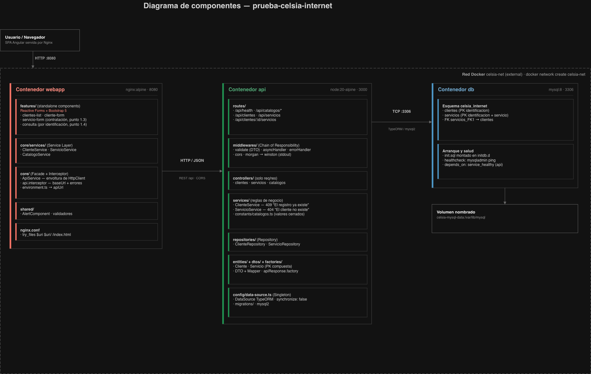

# prueba-celsia-internet

Prueba técnica para **Celsia Internet S.A.S.** — Desarrollo y Operaciones de
Aplicaciones I.

Solución para el proceso de venta: captura y consulta de la información de los
clientes y de los servicios del portafolio de internet que tienen contratados.
Incluye backend, frontend y la configuración de despliegue en contenedores.

| Capa | Tecnología |
|---|---|
| Backend | Node.js 20 LTS + Express + TypeScript |
| ORM | TypeORM |
| Base de datos | MySQL 8 |
| Frontend | Angular 17 (standalone components) + Bootstrap 5 |
| Contenedores | Docker + docker-compose (uno por proyecto) |

---

## Estructura del repositorio

```
api/                    # Backend — Express + TypeScript + TypeORM
|-- docker-compose.yml  # servicios api + db (MySQL 8), con política de logs
|-- Dockerfile          # multi-stage: node:20-alpine build -> runtime
|-- init.sql            # esquema de respaldo, montado en el contenedor MySQL
|-- .env.example
|-- README.md
|-- src/
webapp/                 # Frontend — Angular 17 + Bootstrap 5
|-- docker-compose.yml  # servicio webapp, con política de logs
|-- Dockerfile          # multi-stage: ng build -> nginx
|-- nginx.conf
|-- README.md
|-- src/
assets/
|-- diagrama.png        # diagrama de componentes (punto 2.1)
.github/workflows/      # CI por proyecto, disparado en pull request (extra)
```


## Arquitectura



El navegador consume la SPA de Angular servida por Nginx (`webapp`, puerto
8080). La SPA habla por HTTP/JSON con la API REST (`api`, puerto 3000), que a
su vez persiste en MySQL 8 (`db`, puerto 3306) a través de TypeORM. Los tres
contenedores se comunican por la red Docker externa `celsia-net`, lo que
permite mantener un `docker-compose.yml` por proyecto sin perder la conectividad entre ellos.

El backend está organizado por capas con una responsabilidad por archivo
(`routes → middlewares → controllers → services → repositories → entities`):
el controlador no contiene reglas de negocio ni consultas, y toda ruta async
pasa por un manejador de errores centralizado. El frontend separa `core`
(servicios HTTP, interceptor, modelos), `shared` (componentes y validadores
reutilizables) y `features` (una carpeta por pantalla).

## Puesta en marcha

### Opción A — Docker (la del entregable)

Requiere Docker con Compose v2. La red externa se crea una sola vez:

```bash
docker network create celsia-net

cp api/.env.example api/.env          # ajustar credenciales si se quiere
docker compose -f api/docker-compose.yml up -d --build
docker compose -f webapp/docker-compose.yml up -d --build
```

| Servicio | URL / puerto |
|---|---|
| Webapp | <http://localhost:8080> |
| API | <http://localhost:3000/api> |
| Health check | <http://localhost:3000/api/health> (`503` si MySQL no responde) |
| MySQL | `localhost:3306` |

El esquema lo crea `api/init.sql`, montado en `/docker-entrypoint-initdb.d`
del contenedor de MySQL, que se ejecuta la primera vez que se inicializa el
volumen `celsia-mysql-data`. El servicio `api` arranca solo cuando el
`healthcheck` de MySQL (`mysqladmin ping`) pasa.

Para apagar todo, o para volver a empezar desde una base vacía:

```bash
docker compose -f webapp/docker-compose.yml down
docker compose -f api/docker-compose.yml down          # -v para borrar el volumen
```

### Opción B — local, sin contenedores (desarrollo)

Requiere Node.js 20 y una instancia de MySQL 8 accesible.

```bash
# Backend
cd api
npm install
cp .env.example .env
npm run migration:run      # crea el esquema con las migraciones de TypeORM
npm run dev                # http://localhost:3000

# Frontend (en otra terminal)
cd webapp
npm install
npm start                  # http://localhost:4200
```

El esquema se puede crear de dos formas equivalentes: con las migraciones de
TypeORM (`npm run migration:run`, la vía normal en desarrollo) o con
`init.sql` (la vía que usa el contenedor). `synchronize` está en `false` en
ambos entornos: el esquema nunca se genera solo a partir de las entidades.

## Alcance implementado (puntos 1.1 a 1.4)

| Punto del enunciado | Dónde está |
|---|---|
| **1.1** CRUD de clientes y de sus servicios | API: `/api/clientes` y `/api/servicios` (GET, POST, PUT, DELETE). Webapp: listado de clientes con crear / editar / eliminar. |
| **1.2** Validaciones: sin datos en blanco, tipos según la BD, duplicado → *"El registro ya existe"* | DTOs + middleware `validate` en el backend (autoridad) y Reactive Forms con las mismas reglas en el frontend. |
| **1.3** Formulario de servicios contratados con integridad referencial | `/servicios/nuevo` en la webapp; el backend responde `404 "El cliente no existe"` y la FK `servicios_FK1` lo garantiza en la BD. |
| **1.4** Consulta por número de identificación | `/consulta` en la webapp, sobre `GET /api/clientes/:identificacion/servicios`, que devuelve el cliente y sus servicios en una sola respuesta. |

## Modelo de datos y catálogos

```
clientes (identificacion PK, nombres, apellidos, tipoIdentificacion,
          fechaNacimiento, numeroCelular, correoElectronico)

servicios (identificacion + servicio PK compuesta, fechaInicio,
           ultimaFacturacion, ultimoPago)
           FK servicios_FK1 -> clientes(identificacion)
           ON UPDATE CASCADE ON DELETE NO ACTION
```

Los dos catálogos cerrados del enunciado se definen **una sola vez**, en
`api/src/constants/catalogos.ts`, y se exponen por API
(`GET /api/catalogos/tipos-identificacion` y `GET /api/catalogos/servicios`).
El frontend puebla sus `select` desde ahí; no hay listas duplicadas en
Angular.

- `tipoIdentificacion`: `CC`, `TI`, `CE`, `RC`.
- `servicio`: `Internet 200 MB`, `Internet 400 MB`, `Internet 600 MB`,
  `Directv Go`, `Paramount+`, `Win+`.

## Validaciones y formato de error

Se validan en backend y frontend; **el backend es la autoridad** y el
frontend muestra el mensaje que devuelve la API.

1. Ningún campo en blanco: todos son obligatorios.
2. Tipo y longitud según la BD (`VARCHAR(20)`, `VARCHAR(80)`, `VARCHAR(2)`,
   `DATE`, `INTEGER`).
3. Registro duplicado → **`409`** con el mensaje literal
   **`"El registro ya existe"`** (por `identificacion` en clientes; por la
   pareja `identificacion + servicio` en servicios).
4. Integridad referencial → **`404 "El cliente no existe"`** al contratar un
   servicio de un cliente que no está registrado.
5. Adicionales: formato de correo, `fechaNacimiento` en el pasado, catálogos
   cerrados, `ultimoPago >= 0`.

Todas las respuestas de la API usan el mismo sobre:

```json
{ "success": true,  "message": "OK", "errors": [], "data": {} }
{ "success": false, "message": "El registro ya existe", "errors": [] }
```

Las fechas se serializan siempre como `YYYY-MM-DD`, sin componente de hora.

## Pruebas y CI (extra, fuera del enunciado)

El enunciado no pide pruebas ni pipeline; se agregan como valor añadido y con
el mismo criterio de simplicidad del resto del proyecto: unas pocas pruebas
representativas, no cobertura exhaustiva.

- **API** — Jest + ts-jest sobre la capa de reglas de negocio, con los
  repositorios mockeados (no toca MySQL): alta correcta, duplicado → `409`
  con el mensaje literal, cliente inexistente → `404`.
- **Webapp** — Karma/Jasmine en modo headless: `ClienteService` arma bien la
  petición HTTP (`HttpTestingController`) y el formulario de cliente queda
  inválido con campos vacíos.
- **CI** — dos workflows en `.github/workflows/` (`api.yml`, `webapp.yml`),
  disparados solo en *pull request* y filtrados por carpeta con `paths:`, para
  que un cambio en el frontend no dispare el pipeline del backend. Cada uno
  corre `npm ci` → `npm run test:ci` → `npm run build` → `docker build`, y
  termina con un bloque de despliegue **comentado** (push a ECR + update del
  servicio en ECS) que documenta dónde iría el despliegue real.

```bash
cd api    && npm run test:ci
cd webapp && npm run test:ci
```

---

# 2. Prueba teórico-práctica

## 2.1 Diagrama de componentes

El diagrama está en **[`assets/diagrama.png`](assets/diagrama.png)** y se
muestra en la sección [Arquitectura](#arquitectura). Refleja los tres
contenedores (webapp / api / db) sobre la red `celsia-net`, los componentes
internos de cada uno, el volumen de persistencia y la política de logs.

## 2.2 Mecanismos de seguridad

*¿Qué mecanismos de seguridad incluirás en la aplicación para garantizar la
protección del acceso a los datos?*

La aplicación maneja datos personales (identificación, fecha de nacimiento,
celular, correo), así que la protección tiene que darse en varias capas y no
solo en el login. Divido entre lo que ya está en el código y lo que
incorporaría en un despliegue real.

**Ya implementado en la prueba**

- **Validación y saneamiento de toda la entrada** en el backend mediante DTOs
  y el middleware `validate`: campos obligatorios, tipos, longitudes exactas
  de la BD y valores restringidos a los catálogos. Es la primera defensa
  contra datos corruptos y contra inyección.
- **Consultas parametrizadas**: el acceso a datos pasa siempre por TypeORM
  (`repositories/`), que parametriza los valores; no hay SQL concatenado a
  mano, lo que cierra la vía de SQL injection.
- **CORS restringido** por lista de orígenes (`CORS_ORIGIN`), en lugar de
  `*`.
- **Secretos fuera del código**: credenciales por variables de entorno; solo
  se versiona `.env.example`, y `.env` está en `.gitignore`.
- **Contenedores endurecidos**: imágenes `alpine` mínimas, usuario no root
  (`USER node` en la API, `nginx-unprivileged` en la webapp), build
  multi-stage para que la imagen final no lleve el código fuente ni las
  dependencias de desarrollo.
- **Errores que no filtran detalle interno**: el `errorHandler` traduce las
  excepciones a un mensaje controlado; el stack trace va al log, no a la
  respuesta.
- **Logs sin datos sensibles**: se registra el acceso HTTP (Morgan) y eventos
  de aplicación (Winston), no el cuerpo de las peticiones.

**Lo que agregaría en producción**

- **Autenticación y autorización**: JWT de vida corta con refresh, y
  autorización por rol (asesor de ventas, supervisor, soporte). Cada endpoint
  declararía el permiso que exige; la consulta de un cliente no debería estar
  disponible para cualquier usuario autenticado.
- **HTTPS obligatorio**, con redirección de HTTP a HTTPS.
- **Cabeceras de seguridad** con `helmet` (CSP, `X-Content-Type-Options`,
  `Referrer-Policy`, etc.) y **rate limiting** por IP y por usuario, para
  frenar fuerza bruta.
- **Mínimo privilegio en la base de datos**: usuario de aplicación con
  permisos solo de `SELECT/INSERT/UPDATE/DELETE` sobre las dos tablas, y un usuario distinto y de un
  solo uso para las migraciones. En el compose de la prueba, además, no
  publicaría el puerto 3306 al host: la base solo necesita ser visible dentro
  de `celsia-net`.
- **Gestión de secretos** con AWS Secrets Manager y rotación automática, en lugar de un `.env` en el servidor.
- **Seguridad de la cadena de suministro**: `npm audit` y Dependabot en el
  pipeline, escaneo de imágenes (Trivy) y firma de imágenes antes de
  publicarlas.
- **Análisis estático de código** con SonarQube en pipeline, gate de calidad
  (bugs, vulnerabilidades, code smells, cobertura) antes de mergear a
  `develop`.

## 2.3 Estrategias de escalabilidad

*¿Qué estrategias recomendarías considerando un crecimiento proyectado de
1.000.000 de clientes por año?*

**1. Aplicación sin estado y escalado horizontal.** La API ya es *stateless*
(no guarda sesión en memoria), así que basta con correr N réplicas del
contenedor detrás de un balanceador (Kubernetes) y escalar por CPU o por latencia.

**2. Frontend en CDN.**

**3. Base de datos: leer y escribir por separado.** Una instancia primaria
para escrituras y **réplicas de lectura** para las consultas, con el pool de conexiones
dimensionado y compartido

**4. Índices y paginación.** Las consultas del enunciado ya caen sobre la PK
de `clientes` y sobre el prefijo `identificacion` de la PK compuesta de
`servicios`, que es lo óptimo. Lo que sí hay que corregir antes de crecer es
`GET /api/clientes`, que hoy devuelve la tabla completa: con millones de
filas necesita **paginación por keyset** (`WHERE identificacion > :ultimo
LIMIT :n`, más estable que `OFFSET`) y búsqueda por índice sobre los campos
por los que se filtre.

**5. Caché.** Los catálogos son inmutables: se cachean en el frontend y en
Redis con TTL largo. Para consultas repetidas de un mismo cliente, caché de
lectura.

**6. Asincronía para lo que no es transaccional.** Facturación,
notificaciones o integraciones con terceros salen del camino crítico hacia
una cola (SQS/RabbitMQ/NATS), de modo que un pico en esos procesos no degrade el
alta de clientes.

**7. Observabilidad antes de escalar.** Métricas (p95/p99 por endpoint,
conexiones activas, *slow query log*), trazas distribuidas y alertas: sin
esto, escalar es adivinar. El autoescalado se configura sobre esas métricas.

## 2.4 Patrones de diseño

*¿Qué patrón o patrones recomendarías para esta solución y cómo se
implementarán?*

Los patrones que siguen no son teóricos: están aplicados en el código de esta
prueba, y por eso los justifico con el archivo donde viven.

**Backend**

| Patrón | Implementación | Por qué |
|---|---|---|
| **Repository** | `api/src/repositories/` | Aísla TypeORM de las reglas de negocio. Los servicios dependen del contrato del repositorio, no de `Repository<T>`, así que se pueden probar con un mock y un cambio de ORM no toca la capa de negocio. |
| **DTO + Mapper** | `api/src/dtos/` | La entidad nunca se expone tal cual: cada dominio tiene su `ResponseDto` y una función de mapeo. Evita filtrar columnas internas y desacopla el contrato de la API del esquema de la BD. |
| **Inyección de dependencias por constructor** | `ClienteService`, `ServicioService` | Los servicios reciben sus repositorios, no los instancian. |
| **Singleton** | `api/src/config/data-source.ts` | Un único `DataSource` de TypeORM —y por tanto un único pool de conexiones— para todo el proceso. Varias instancias multiplicarían las conexiones contra la base. |
| **Middleware / Chain of Responsibility** | `middlewares/` | Cada petición atraviesa una cadena (CORS → log → parseo → validación → controlador → `errorHandler`). Añadir autenticación o *rate limiting* mañana es insertar un eslabón, no tocar los controladores. |
| **Factory** | `factories/apiResponse.factory.ts` | `successResponse()` / `errorResponse()` construyen el sobre `{ success, message, errors, data }` en un solo lugar; garantiza que el formato de error sea idéntico en toda la API. |

**Frontend**

| Patrón | Implementación | Por qué |
|---|---|---|
| **Service Layer** | `core/services/` | Los componentes no llaman a `HttpClient`; hablan con `ClienteService`, `ServicioService` y `CatalogoService`. |
| **Interceptor** | `core/interceptors/api.interceptor.ts` | Resuelve la URL base desde `environment` y normaliza los errores HTTP al mensaje que ya viene del backend, para que los componentes solo muestren `err.message`. |
| **Observer (RxJS)** | Toda la capa HTTP | Las respuestas se consumen como `Observable`, y los estados de carga se derivan de esos eventos. |

**Lo que agregaría si la solución creciera** — y deliberadamente *no* está
aquí, porque para el alcance de la prueba sería sobreingeniería: **Unit of
Work** (transacciones de TypeORM) cuando una operación tenga que escribir en
varias tablas de forma atómica; **Strategy** si las reglas de contratación
empiezan a variar por tipo de servicio o por campaña.

## 2.5 Optimización del manejo y la persistencia de datos

*¿Qué recomendaciones harías teniendo en cuenta que esta aplicación tiene
alta transaccionalidad?*

**1. Transacciones cortas.** Mientras una transacción está abierta, las
filas que tocó quedan bloqueadas para los demás.

**2. Todo acceso por índice.** Sin índice, MySQL recorre la tabla completa
para encontrar una fila. El modelo ya lo resuelve: `clientes` busca por su
llave primaria, y la llave compuesta de `servicios` empieza por
`identificacion`, así que listar los servicios de un cliente también usa
índice, sin agregar nada. Falta cuidar dos cosas al consultar: traer el
cliente y sus servicios en una sola consulta con `relations` de TypeORM
—no una consulta por cliente (problema N+1)— y paginar los listados que
puedan crecer.

**3. Pool de conexiones dimensionado.** MySQL acepta un número limitado de
conexiones (`max_connections`). El pool de la API debe quedar por debajo de ese
límite, contando todas las réplicas: si sobran conexiones, la base se satura;
si faltan, las peticiones hacen fila.

**4. Guardar solo lo vigente.** Con años de historia, la tabla de servicios
crece sin parar. Los datos antiguos se mueven a una tabla histórica (o se
particiona por fecha), para que las consultas del día a día sigan sobre una
tabla pequeña.

---

# 3. Redes

## 3.1 Router vs. switch

El **switch** trabaja en la **capa 2** y conecta equipos **dentro de una
misma red local** usando direcciones **MAC**. El **router** trabaja en la
**capa 3** y comunica **redes distintas** usando direcciones **IP**.

- **Switch**: cuando hay que conectar equipos de la misma LAN (los PC de una
  oficina, los servidores de un rack).
- **Router**: cuando hay que unir redes diferentes o salir a Internet
  (conectar la LAN con el enlace del ISP, unir dos sedes).


## 3.2 Las siete capas del modelo OSI

| # | Capa | Función principal | Ejemplos |
|---|---|---|---|
| 7 | **Aplicación** | Los programas que usa la persona. | HTTP, DNS, SMTP |
| 6 | **Presentación** | Da formato a los datos: codifica, cifra, comprime. | TLS, JPEG, UTF-8 |
| 5 | **Sesión** | Abre, mantiene y cierra la conversación entre los dos extremos. | RPC, NetBIOS |
| 4 | **Transporte** | Lleva los datos de extremo a extremo y controla errores. | TCP, UDP |
| 3 | **Red** | Direcciona y enruta los paquetes entre redes. | IP |
| 2 | **Enlace de datos** | Mueve los datos entre equipos de la misma red (MAC). | Ethernet, ARP, PPP |
| 1 | **Física** | Envía los bits por el cable o el aire. | Cable UTP, fibra, WiFi |


## 3.3 TCP vs. UDP

Los dos son protocolos de **capa 4**, pero con prioridades opuestas: TCP
prioriza que los datos lleguen completos; UDP, que lleguen rápido.

| | TCP | UDP |
|---|---|---|
| Conexión | Abre conexión antes de enviar | Envía sin abrir conexión |
| Fiabilidad | Reenvía lo perdido y ordena los datos | No garantiza entrega ni orden |
| Velocidad | Más lento | Más rápido y ligero |

**TCP** cuando los datos no pueden perderse: web, consultas a MySQL,
transferencia de archivos, correo. En esta aplicación todo va sobre TCP
(navegador → Nginx, webapp → API, API → MySQL): perder parte de un registro
de cliente no es aceptable.

**UDP** cuando importa más la rapidez que la exactitud: video y llamadas en
línea (un cuadro perdido no se nota, un retardo sí), juegos en línea, DNS.

## 3.4 Máscara de subred y subneteo

La **máscara de subred** indica qué parte de una dirección IP identifica la
**red** y qué parte identifica al **equipo**. Se escribe como
`255.255.255.0` o, de forma abreviada, `/24`. Con ella el router sabe si el
destino está en la red local o hay que sacarlo hacia afuera.

Ejemplo: en `192.168.10.25` con máscara `/24`, `192.168.10` es la red y `25`
es el equipo dentro de esa red.

**Subnetear** es partir una red grande en varias más pequeñas moviendo el
límite de la máscara. Mientras más grande el número (`/24` → `/26`), más
subredes y menos equipos en cada una.

Ejemplo — partir `192.168.10.0/24` (254 equipos) en cuatro subredes `/26` de
62 equipos cada una:

| Subred | Rango | Red | Broadcast |
|---|---|---|---|
| 1 | `192.168.10.0/26` | `.0` | `.63` |
| 2 | `192.168.10.64/26` | `.64` | `.127` |
| 3 | `192.168.10.128/26` | `.128` | `.191` |
| 4 | `192.168.10.192/26` | `.192` | `.255` |


## 3.5 Protocolos de enrutamiento dinámico

Las rutas se pueden escribir a mano (estáticas) o dejar que los routers las
aprendan solos. Los protocolos de enrutamiento dinámico hacen justamente eso:
los routers **se avisan entre sí qué redes conocen** y, si un enlace se cae,
recalculan el camino sin intervención manual.

Hay dos formas de lograrlo:

- **Vector distancia** — cada router le cuenta a sus vecinos lo que sabe. No
  conoce la red completa, confía en lo que le informan.
- **Estado de enlace** — cada router comparte el estado de sus enlaces con
  todos. Así todos arman el mismo mapa de la red y calculan la mejor ruta.

Los más usados:

| Protocolo | Tipo | Cómo funciona |
|---|---|---|
| **RIP** | Vector distancia | Elige la ruta con menos saltos (routers intermedios). Simple, pero solo sirve en redes chicas: a los 15 saltos se rinde. |
| **OSPF** | Estado de enlace | Cada router publica sus enlaces, todos arman el mismo mapa y calculan la ruta más corta. Es el estándar dentro de una empresa. |
| **EIGRP** | Híbrido (Cisco) | Como vector distancia, pero además mira ancho de banda y retardo, no solo saltos. Converge muy rápido. |
| **BGP** | Vector de ruta | El que usan los ISP para conectarse entre sí en Internet. Intercambia el camino completo de redes y decide por políticas del operador, no solo por distancia. |

---

## Git-flow

```
main
 |-- develop
      |-- juadiga        # rama de desarrollo
```

Se trabaja en la rama del desarrollador, se integra a `develop` por *pull
request* —lo que dispara los workflows de CI— y de `develop` a `main` solo al
finalizar la prueba. Los commits siguen Conventional Commits (`feat:`,
`fix:`, `chore:`, `docs:`). No se versionan `.env`, `node_modules` ni `dist`.

### Políticas de protección de ramas

`develop` es la **rama por defecto** del repositorio, en línea con el
esquema de git-flow: el trabajo en curso vive ahí, y `main` solo recibe
código ya integrado.

`main` y `develop` tienen **branch protection** habilitado en GitHub:

- **Pull request obligatorio** para poder mezclar; nada de *push* directo a
  estas dos ramas.
- **Al menos una aprobación** requerida antes de mezclar, y se descarta la
  aprobación si llegan nuevos commits al PR (*dismiss stale reviews*).
- La regla **aplica también al administrador** (`enforce_admins`): ni el
  admin puede saltarse el flujo de PR aprobado por *push* directo o *force
  push*.
- **Sin `force-push`** ni **borrado** de `main`/`develop`.